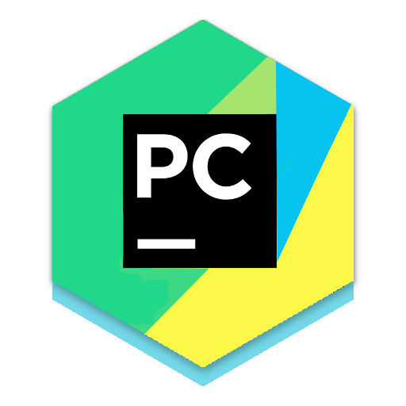
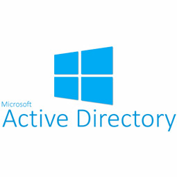
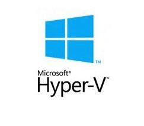
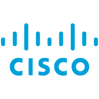

<h1 align="center">Hi there </h1>

## I can be Data Scientist, Engineer, Developer and Student

- :woman_student:   I’m currently learning `Data Analysis`, `ML`, `DL`

- :briefcase:  I have work experience involved with IT field widely about 2.5 years
  - Web Development
  - Application SW Development
  - Server & Network
  - Database
  - ETC
  
- :school:  My background in University is `IT Engineering`

- :goal_net:  2020 Goal : Do data analysis and AI Projects as much as possible

   

---

## Languages and Tools

 

 

 

 
 

 

---

<!-- 나중에 추가할 skill
 
 
-->